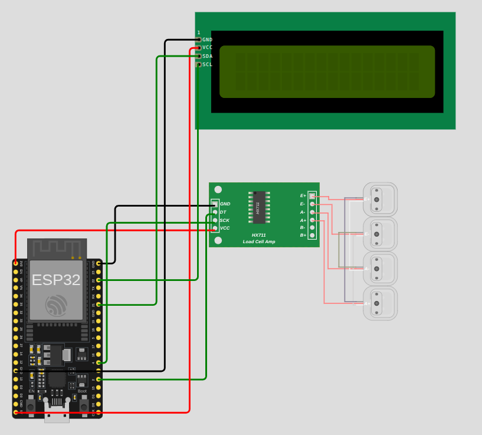

# 1. Challenge-2 (Simulation)

**Measuring Weight with a Load Cell, HX711, and LCD**\
Design and Implement an embedded system to read the weight (until 50kg) from a load cell connected through\
an HX711 amplifier, display the measured value in real-time on an LCD screen (16x2), and print it to the Serial\
Monitor.

## Metodología de diseño e implementación de sistemas embebidos
### 1. Análisis de requerimientos
#### Requerimientos funcionales

- FR-01: El sistema debe permitir realizar medidas de peso hasta 50Kg
- FR-02: El sistema debe mostrar el peso por medio de una pantalla LCD en unidades de Kg
- FR-03: El sistema debe mostrar la medida del peso en todo momento
- FR-04: El sistema debe mostrar la medida del peso por medio de la salida serial
- FR-05: El sistema debe contar con cuatro celdas de carga y usar el integrado HX711

#### Requerimientos no funcionales

- NFR-01: El sistema debe iniciar automaticamente al conectarse a la energía
- NFR-02: La medición del peso debe realizarse en todo momento
- NFR-03: Las 4 celdas de carga deben ubicarse en 4 puntos distribuidos uniformemente a lo largo del área de presión
- NFR-04: La pantalla LCD debe encender la luz de fondo para visualizar mejor la medida desplegada.

#### Restricciones

- CON-01: La pantalla LCD debe tener 16 columnas y 2 filas y comunicarse por medio del protocolo I2C
- CON-02: El módulo HX711 se debe conectar a dos pines GPIO digitales de la tarjeta ESP32
- CON-03: Las celdas de carga deben conectarse al módulo HX711
- CON-05: Se dbe hacer una simulación usando [Wokwi](https://wokwi.com/)
- CON-06: Se debe hacer la simulación del sistema usando una placa de desarrollo ESP32

### 2. Análisis del sistema y diseño (arquitectura y componentes)

1. Placa de desarrollo ESP32 S3 DevKit C
2. Módulo para celdas de carga HX711
3. 4 celdas de carga
4. Pantalla LCD 16x2 con protocolo I2C
5. 15 jumpers variados

### 3. Diseño de Hardware e Integración



### 4. Diseño y desarrollo del firmware

**Pseudocódigo**
```
SET factor_calibración ← 50.0 / 21000.0
INICIALIZAR SALIDA SERIAL
INICIALIZAR BÁSCULA
INICIALIZAR PANTALLA LCD

INICIO CICLO
  SET lectura ← PESO DE LA BÁSCULA
  SET peso ← lectura * factor_calibración

  DEFINIR POSICIÓN LCD (0, 0)
  MOSTRAR TEXTO LCD "Peso: "
  DEFINIR POSICIÓN LCD (6, 0)
  MOSTRAR TEXTO LCD peso
  MOSTRAR TEXTO LCD " Kg"

  MOSTRAR TEXTO CONSOLA SERIAL "Peso: " + peso + " Kg"

  DEMORA 300 ms
FIN CICLO
```

**Código simulación**

```
#include "HX711.h"
#include <Wire.h>
#include <LiquidCrystal_I2C.h>

const int pinDOUT = 2;
const int pinSCK = 4;

HX711 scale;
float SCALE_50KG = 50.0 / 21000.0;

LiquidCrystal_I2C lcd(0x27, 16, 2);

void setup() {
  Serial.begin(115200);

  lcd.init();
  lcd.backlight();
  lcd.print("Initializing...");

  scale.begin(pinDOUT, pinSCK);
  while (!scale.is_ready()) {
    delay(50);
  }

  scale.set_scale(1.0);

  lcd.clear();
}

void loop() {
  float raw = scale.get_units(1);
  float kg = raw * SCALE_50KG;

  lcd.setCursor(0, 0);
  lcd.print("Peso:      ");
  lcd.setCursor(6, 0);
  lcd.print(kg, 2);
  lcd.print("kg");
  Serial.println("Peso: " + String(kg, 2) + " Kg");
  delay(300);
}
```

### 5. Pruebas y validación

[Enlace a la simulación](https://wokwi.com/projects/448158164631347201)
