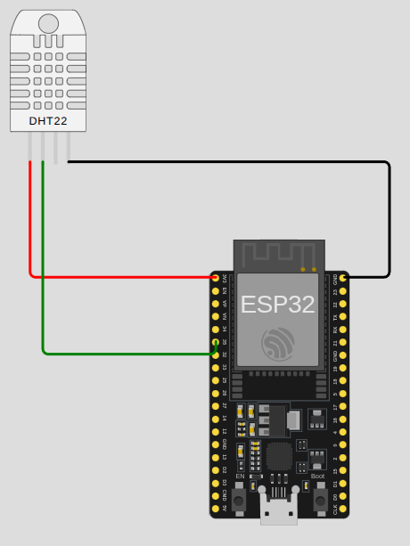

# 1. Challenge 2 - ESP32 MQTT-Based IoT System

Design and implement a system where the ESP32 communicates using the MQTT protocol. The system must:

**Functional Requirements**

**1. Telemetry Publishing**
- Publish temperature and humidity readings periodically (topic naming must follow good structure, e.g., esp32/sensors/dht22).
**2. Data Logging or Visualization**
- Use an MQTT dashboard to show sensor values over time.
**3. Setpoint Subscription**
- Subscribe to a topic (e.g., esp32/control/rpm) for motor RPM setpoint.
- Display the received setpoint via Serial Monitor.
**4. Broker Connectivity**
- Use a cloud broker (e.g., HiveMQ Cloud).
- Document your topic structure and message format.
**5. Additional Notes**
* Motor hardware is not required.
* Ensure QoS selection is justified.
* All messages must follow a clean JSON structure.

## Metodología de diseño e implementación de sistemas embebidos
### 1. Análisis de requerimientos
#### Requerimientos funcionales

- FR-01: El sistema 
- FR-02: Al presionar el botón por primera vez el sistema debe encender los LEDs en secuencia a intervalos de 1s, solamente puede haber un LED encendido a la vez
- FR-03: Al presionar el botón por segunda vez el sistema debe quedar en pausa. El LED que estaba encendido cuando se presionó el botón debe quedar encendido.
- FR-04: Al presionar el botón por tercera vez el sistema debe seguir encendiendo y apagando los LEDS, comenzando por donde terminó.
- FR-05: El botón debe implementar algún método de antirrebote para evitar inconsistencias en el comportamiento del sistema
- FR-06: El botón debe activarse con un pulso negativo

#### Requerimientos no funcionales

- NFR-01: El sistema debe iniciar automaticamente al conectarse a la energía
- NFR-02: Los LEDs deben proveer el tipo de luminosidad de chorro
- NFR-03: Los LEDSs debe arreglarse en línea recta con un espaciado uniforme
- NFR-04: El color de los 4 LEDs debe ser distinto

#### Restricciones

- CON-01: Los LEDs debe conectarse a los pines GPIO y activarse con señales digitales
- CON-02: Debe implementarse una resistencia pull-Up interna para el botón
- CON-03: Los LEDs debe conectarse en serie con una resistencia para limitar la corriente
- CON-04: Se debe entregar el código del sistema en lenguaje Arduino C++ en un archivo con extensión **.ino**
- CON-05: Se dbe hacer una simulación usando [Wokwi](https://wokwi.com/)
- CON-06: Se debe hacer la implementación del sistema usando una placa de desarrollo ESP32 S3 y una protoboard

### 2. Análisis del sistema y diseño (arquitectura y componentes)

1. Placa de desarrollo ESP32 S3 DevKit C
2. Pulsador de cuatro pines
3. 4 LEDs de 3mm de diferentes colores con luminosidad a chorro
4. 4 Resistencias de 220 Ohm, 1/4 W y tolerancia de 10%.
5. 6 jumpers hembra-macho
6. 2 jumpers macho-macho
7. Protoboard

### 3. Diseño de Hardware e Integración



### 4. Diseño y desarrollo del firmware

**Pseudocódigo**
```
SET estado ← Pausa
SET ledEncendido ← 1
SET intervaloLEDS ← 1000

INICIO CICLO

  SI boton presionado ENTONCES
    SI estado = Pausa ENTONCES
      SET estado ← Ejecucion
    SINO
      SET estado ← Pausa
    FIN SI
  FIN SI

  SI (estado = Ejecucion) & (tiempoActual - ultimaActualización) > intervaloLEDS ENTONCES
    SET ultimaActualización ← tiempoActual

    PARA I DE 1 A 4
      APAGA LED No. I
    FIN PARA

    ENCENDER LED No. ledEncendido

    SET ledEncendido ← ledEncendido + 1

    SI ledEncendido >= 5 ENTONCES
      SET ledEncendido ← 1
    FIN SI
  FIN SI

FIN CICLO
```

**Código simulación**

```
// Pines de los LEDs (ajusta según tu conexión)
const int leds[4] = {16, 4, 0, 2};

// Pin del botón
const int pinBoton = 22;

// Variables de control
bool activo = false;                // Estado: encendido/apagado de la secuencia
int ledActual = 0;                  // LED actual encendido
unsigned long ultimaActualizacion = 0;        // Última actualización de LED
unsigned long tiempoBoton = 0;    // Tiempo del último cambio del botón
const unsigned long intervalo = 1000; // Intervalo entre LEDs (1 segundo)
const unsigned long tiempoRebote = 200; // Antirrebote del botón (200 ms)

// Lectura previa del botón
int ultimoEstadoBoton = HIGH;

void setup() {
  // Configuración de pines
  for (int i = 0; i < 4; i++) {
    pinMode(leds[i], OUTPUT);
    digitalWrite(leds[i], LOW);
  }
  pinMode(pinBoton, INPUT_PULLUP); // Botón con resistencia interna
  Serial.begin(9600);
}

void loop() {
  // --- LECTURA DEL BOTÓN CON ANTIRREBOTE ---
  int estadoBoton = digitalRead(pinBoton);

  if (estadoBoton == LOW && ultimoEstadoBoton == HIGH && (millis() - tiempoBoton > tiempoRebote)) {
    activo = !activo; // Cambia el estado (toggle)
    tiempoBoton = millis();
    Serial.print("Estado: ");
    Serial.println(activo ? "Activo" : "Parado");
  }
  ultimoEstadoBoton = estadoBoton;

  // --- CONTROL DE LA SECUENCIA ---
  if (activo && (millis() - ultimaActualizacion >= intervalo)) {
    ultimaActualizacion = millis();

    // Apagar todos los LEDs
    for (int i = 0; i < 4; i++) {
      digitalWrite(leds[i], LOW);
    }

    // Encender el LED actual
    digitalWrite(leds[ledActual], HIGH);

    // Avanzar al siguiente LED
    ledActual++;
    if (ledActual >= 4) {
      ledActual = 0; // Vuelve al primero (cíclico)
    }
  }
}
```
**Código implementación**

```
// Pines de los LEDs (ajusta según tu conexión)
const int leds[4] = {47, 48, 45, 35};

// Pin del botón
const int pinBoton = 36;

// Variables de control
bool activo = false;                // Estado: encendido/apagado de la secuencia
int ledActual = 0;                  // LED actual encendido
unsigned long ultimaActualizacion = 0;        // Última actualización de LED
unsigned long tiempoBoton = 0;    // Tiempo del último cambio del botón
const unsigned long intervalo = 1000; // Intervalo entre LEDs (1 segundo)
const unsigned long tiempoRebote = 200; // Antirrebote del botón (200 ms)

// Lectura previa del botón
int ultimoEstadoBoton = HIGH;

void setup() {
  // Configuración de pines
  for (int i = 0; i < 4; i++) {
    pinMode(leds[i], OUTPUT);
    digitalWrite(leds[i], LOW);
  }
  pinMode(pinBoton, INPUT_PULLUP); // Botón con resistencia interna
  Serial.begin(9600);
}

void loop() {
  // --- LECTURA DEL BOTÓN CON ANTIRREBOTE ---
  int estadoBoton = digitalRead(pinBoton);

  if (estadoBoton == LOW && ultimoEstadoBoton == HIGH && (millis() - tiempoBoton > tiempoRebote)) {
    activo = !activo; // Cambia el estado (toggle)
    tiempoBoton = millis();
    Serial.print("Estado: ");
    Serial.println(activo ? "Activo" : "Parado");
  }
  ultimoEstadoBoton = estadoBoton;

  // --- CONTROL DE LA SECUENCIA ---
  if (activo && (millis() - ultimaActualizacion >= intervalo)) {
    ultimaActualizacion = millis();

    // Apagar todos los LEDs
    for (int i = 0; i < 4; i++) {
      digitalWrite(leds[i], LOW);
    }

    // Encender el LED actual
    digitalWrite(leds[ledActual], HIGH);

    // Avanzar al siguiente LED
    ledActual++;
    if (ledActual >= 4) {
      ledActual = 0; // Vuelve al primero (cíclico)
    }
  }
}
```
### 5. Pruebas y validación

[Enlace al archivo con el código Arduino/C++](./Lab1-Challenge1/Lab1-Challenge1.ino)

[Enlace a la simulación](https://wokwi.com/projects/445808350528060417)

